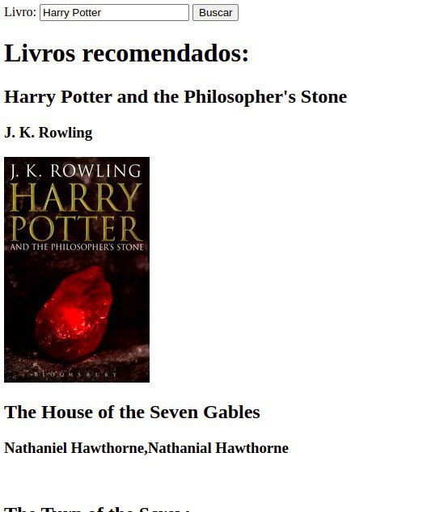
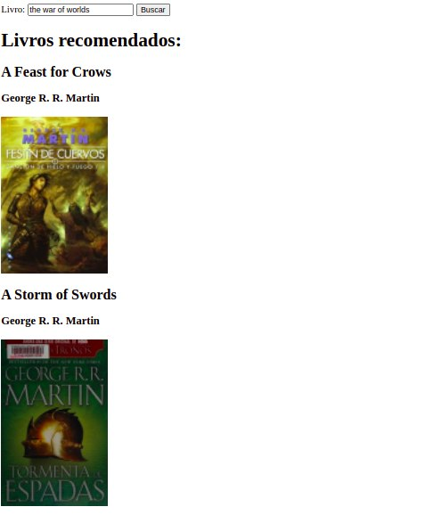
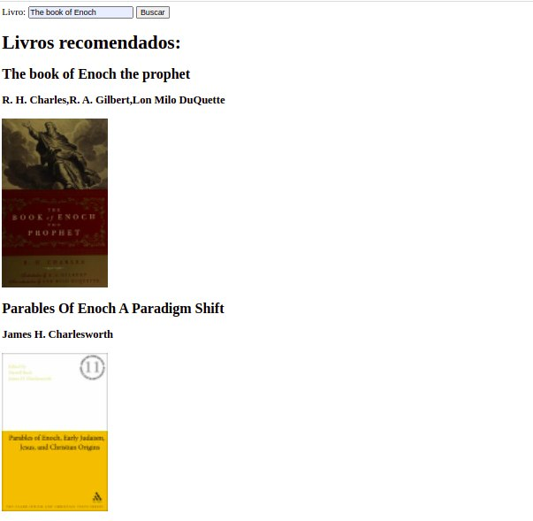

# Trabalho Final - Dupla 19

**Número da Lista**: 6<br>
**Conteúdo da Disciplina**: Trabalho Final<br>
**Apresentação**: 

## Alunos
|Matrícula | Aluno |
| -- | -- |
| 18/0023411  |  Maicon Lucas Mares de Souza |
| 18/0018574  |  Hérya Rodrigues Alcantara |

## Sobre 
Book Deliver é uma aplicação construída com o propósito de recomendar livros semelhantes a um livro desejado. A aplicação se baseia no algoritmo de Maximum Spanning Tree (não Minimum Spanning Tree) para a geração dos clusters iniciais, seguido do cálculo do cluster de maior peso. Os livros recomendados são aqueles presentes no cluster de maior peso.
## Screenshots





## Instalação 
**Linguagem**: JavaScript<br>

* Pré-requisitos:
  * [Git](https://git-scm.com/)
  * [NodeJS](https://nodejs.org/en/)
  * [NPM](https://docs.npmjs.com/downloading-and-installing-node-js-and-npm)
  
 
 * Clonar o repositório
 
  * Instalar dependências
  ```bash
  npm install
  ```
  
 * Executar o projeto
  ```bash
  npm run build
  npm run dev
  ```
  
  * Acessar a aplicação
  ```
  http://localhost:8080/
  ```
 


